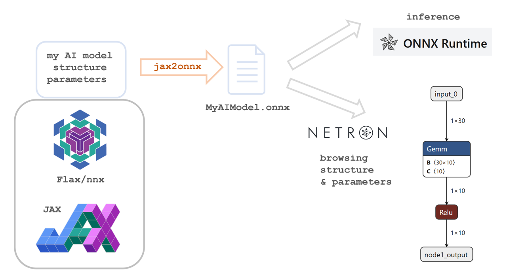

# jax2onnx




`jax2onnx` converts your JAX/Flax model directly into the ONNX format.  

### **Approach**
Components can be easily added as plugins, including their test cases, which are automatically picked up by **pytest**. Each test case sends random input tensors through the JAX/Flax model and compares the output with the ONNX model to ensure correctness.

This library follows a **test-driven and demand-driven** approach, giving you **full control** over how JAX/Flax components are mapped to ONNX—**no hidden magic, no black-box abstraction**. While it may not cover every use case out of the box, you can **extend it by adding your own plugins** and contribute them back to the project. 🚀

### **Supported and Planned JAX/ONNX Components**

 JAX Component                                                                                                                              | ONNX Component                                                                       | since  | v0.1.0 |
|:--------------------------------------------------------------------------------------------------------------------------------------------|:-------------------------------------------------------------------------------------|:-------|:------:|
| [`flax.nnx.AvgPool`](https://flax-linen.readthedocs.io/en/latest/api_reference/flax.linen/layers.html#flax.linen.avg_pool)                  | [`AveragePool`](https://onnx.ai/onnx/operators/onnx__AveragePool.html)               | v0.1.0 |   ✅    |
| [`flax.nnx.BatchNorm`](https://flax.readthedocs.io/en/latest/api_reference/flax.nnx/nn/normalization.html#flax.nnx.BatchNorm)               | [`BatchNormalization`](https://onnx.ai/onnx/operators/onnx__BatchNormalization.html) | v0.1.0 |   ✅    |
| [`flax.nnx.Conv`](https://flax.readthedocs.io/en/latest/api_reference/flax.nnx/nn/linear.html#flax.nnx.Conv)                                | [`Conv`](https://onnx.ai/onnx/operators/onnx__Conv.html)                             | v0.1.0 |   ✅    |
| [`flax.nnx.ConvTranspose`](https://flax.readthedocs.io/en/latest/api_reference/flax.nnx/nn/linear.html#flax.nnx.ConvTranspose)              | [`ConvTranspose`](https://onnx.ai/onnx/operators/onnx__ConvTranspose.html)           |        |   ➖    |
| [`flax.nnx.Dropout`](https://flax.readthedocs.io/en/latest/api_reference/flax.nnx/nn/stochastic.html#flax.nnx.Dropout)                      | [`Dropout`](https://onnx.ai/onnx/operators/onnx__Dropout.html)                       | v0.1.0 |   ✅    |
| [`flax.nnx.Einsum`](https://flax.readthedocs.io/en/latest/api_reference/flax.nnx/nn/linear.html#flax.nnx.Einsum)                            | [`Einsum`](https://onnx.ai/onnx/operators/onnx__Einsum.html)                         | v0.1.0 |   ➖    |
| [`flax.nnx.LayerNorm`](https://flax.readthedocs.io/en/latest/api_reference/flax.nnx/nn/normalization.html#flax.nnx.LayerNorm)               | [`LayerNormalization`](https://onnx.ai/onnx/operators/onnx__LayerNormalization.html) | v0.1.0 |   ✅    |
| [`flax.nnx.Linear`](https://flax.readthedocs.io/en/latest/api_reference/flax.nnx/nn/linear.html#flax.nnx.Linear)                            | [`Gemm`](https://onnx.ai/onnx/operators/onnx__Gemm.html)                             | v0.1.0 |   ✅    |
| [`flax.nnx.LinearGeneral`](https://flax.readthedocs.io/en/latest/api_reference/flax.nnx/nn/linear.html#flax.nnx.LinearGeneral)              | [`Gemm`](https://onnx.ai/onnx/operators/onnx__Gemm.html)                             | v0.1.0 |   ✅    |
| [`flax.nnx.MaxPool`](https://flax-linen.readthedocs.io/en/latest/api_reference/flax.linen/layers.html#flax.linen.max_pool)                  | [`MaxPool`](https://onnx.ai/onnx/operators/onnx__MaxPool.html)                       | v0.1.0 |   ✅    |
| [`flax.nnx.MultiHeadAttention`](https://flax.readthedocs.io/en/latest/api_reference/flax.nnx/nn/attention.html#flax.nnx.MultiHeadAttention) | [`Attention`](https://onnx.ai/onnx/operators/onnx__Attention.html)                   | v0.1.0 |   ✅    |
| [`jax.lax.slice`](https://jax.readthedocs.io/en/latest/_autosummary/jax.lax.slice.html)                                                     | [`Slice`](https://onnx.ai/onnx/operators/onnx__Slice.html)                           | v0.1.0 |   ✅    |
| [`jax.nn.celu`](https://jax.readthedocs.io/en/latest/jax.nn.html#jax.nn.celu)                                                               | [`Celu`](https://onnx.ai/onnx/operators/onnx__Celu.html)                             | v0.1.0 |   ✅    |
| [`jax.nn.dot_product_attention`](https://jax.readthedocs.io/en/latest/_autosummary/jax.nn.dot_product_attention.html)                       | N/A                                                                                  | v0.1.0 |   ✅    |
| [`jax.nn.elu`](https://jax.readthedocs.io/en/latest/jax.nn.html#jax.nn.elu)                                                                 | [`Elu`](https://onnx.ai/onnx/operators/onnx__Elu.html)                               | v0.1.0 |   ✅    |
| [`jax.nn.gelu`](https://jax.readthedocs.io/en/latest/jax.nn.html#jax.nn.gelu)                                                               | [`Gelu`](https://onnx.ai/onnx/operators/onnx__Gelu.html)                             | v0.1.0 |   ✅    |
| [`jax.nn.glu`](https://jax.readthedocs.io/en/latest/jax.nn.html#jax.nn.glu)                                                                 | N/A                                                                                  |        |   ➖    |
| [`jax.nn.hard_sigmoid`](https://jax.readthedocs.io/en/latest/jax.nn.html#jax.nn.hard_sigmoid)                                               | [`HardSigmoid`](https://onnx.ai/onnx/operators/onnx__HardSigmoid.html)               |        |   ➖    |
| [`jax.nn.hard_silu`](https://jax.readthedocs.io/en/latest/jax.nn.html#jax.nn.hard_silu)                                                     | N/A                                                                                  |        |   ➖    |
| [`jax.nn.hard_swish`](https://jax.readthedocs.io/en/latest/jax.nn.html#jax.nn.hard_swish)                                                   | N/A                                                                                  |        |   ➖    |
| [`jax.nn.hard_tanh`](https://jax.readthedocs.io/en/latest/jax.nn.html#jax.nn.hard_tanh)                                                     | N/A                                                                                  |        |   ➖    |
| [`jax.nn.leaky_relu`](https://jax.readthedocs.io/en/latest/jax.nn.html#jax.nn.leaky_relu)                                                   | [`LeakyRelu`](https://onnx.ai/onnx/operators/onnx__LeakyRelu.html)                   | v0.1.0 |   ✅    |
| [`jax.nn.log_sigmoid`](https://jax.readthedocs.io/en/latest/jax.nn.html#jax.nn.log_sigmoid)                                                 |                                                                                      | v0.1.0 |   ✅    |
| [`jax.nn.log_softmax`](https://jax.readthedocs.io/en/latest/jax.nn.html#jax.nn.log_softmax)                                                 | [`LogSoftmax`](https://onnx.ai/onnx/operators/onnx__LogSoftmax.html)                 | v0.1.0 |   ✅    |
| [`jax.nn.relu`](https://jax.readthedocs.io/en/latest/jax.nn.html#jax.nn.relu)                                                               | [`Relu`](https://onnx.ai/onnx/operators/onnx__Relu.html)                             | v0.1.0 |   ✅    |
| [`jax.nn.sigmoid`](https://jax.readthedocs.io/en/latest/jax.nn.html#jax.nn.sigmoid)                                                         | [`Sigmoid`](https://onnx.ai/onnx/operators/onnx__Sigmoid.html)                       | v0.1.0 |   ✅    |
| [`jax.nn.silu`](https://jax.readthedocs.io/en/latest/jax.nn.html#jax.nn.silu)                                                               | N/A                                                                                  |        |   ➖    |
| [`jax.nn.softplus`](https://jax.readthedocs.io/en/latest/jax.nn.html#jax.nn.softplus)                                                       | [`Softplus`](https://onnx.ai/onnx/operators/onnx__Softplus.html)                     | v0.1.0 |   ✅    |
| [`jax.nn.softsign`](https://jax.readthedocs.io/en/latest/jax.nn.html#jax.nn.softsign)                                                       | [`Softsign`](https://onnx.ai/onnx/operators/onnx__Softsign.html)                     | v0.1.0 |   ✅    |
| [`jax.nn.softmax`](https://jax.readthedocs.io/en/latest/jax.nn.html#jax.nn.softmax)                                                         | [`Softmax`](https://onnx.ai/onnx/operators/onnx__Softmax.html)                       | v0.1.0 |   ✅    |
| [`jax.nn.tanh`](https://jax.readthedocs.io/en/latest/jax.nn.html#jax.nn.tanh)                                                               | [`Tanh`](https://onnx.ai/onnx/operators/onnx__Tanh.html)                             | v0.1.0 |   ✅    |
| [`jax.numpy.add`](https://jax.readthedocs.io/en/latest/_autosummary/jax.numpy.add.html)                                                     | [`Add`](https://onnx.ai/onnx/operators/onnx__Add.html)                               | v0.1.0 |   ✅    |
| [`jax.numpy.concat`](https://jax.readthedocs.io/en/latest/_autosummary/jax.numpy.concat.html)                                               | [`Concat`](https://onnx.ai/onnx/operators/onnx__Concat.html)                         | v0.1.0 |   ✅    |
| [`jax.numpy.einsum`](https://jax.readthedocs.io/en/latest/_autosummary/jax.numpy.einsum.html)                                               | [`Einsum`](https://onnx.ai/onnx/operators/onnx__Einsum.html)                         | v0.1.0 |   ✅    |
| [`jax.numpy.matmul`](https://jax.readthedocs.io/en/latest/_autosummary/jax.numpy.matmul.html)                                               | [`MatMul`](https://onnx.ai/onnx/operators/onnx__MatMul.html)                         | v0.1.0 |   ✅    |
| [`jax.numpy.reshape`](https://jax.readthedocs.io/en/latest/_autosummary/jax.numpy.reshape.html)                                             | [`Reshape`](https://onnx.ai/onnx/operators/onnx__Reshape.html)                       | v0.1.0 |   ✅    |
| [`jax.numpy.squeeze`](https://docs.jax.dev/en/latest/_autosummary/jax.numpy.squeeze.html#jax.numpy.squeeze)                                 | [`Squeeze`](https://onnx.ai/onnx/operators/onnx__Squeeze.html)                       | v0.1.0 |   ✅    |
| [`jax.numpy.transpose`](https://docs.jax.dev/en/latest/_autosummary/jax.numpy.transpose.html#jax.numpy.transpose)                               | [`Transpose`](https://onnx.ai/onnx/operators/onnx__Transpose.html)                   | v0.1.0 |   ✅    |

✅ = implemented with unit test for eval<br>
❌ = planned but not implemented, yet<br>
➖ = not planned for the upcoming version

Examples

| Component Name | Description                                               | From   | v0.1.0 |
|:---------------|:----------------------------------------------------------|:-------|:------:|
| `MLP`          | Linear and Relu                                           | v0.1.0 |    ✅ |
| `MNIST - CNN`  | CNN based MNIST classification                            | v0.1.0 |     ✅   |
| `MNIST - CNN2` | CNN based MNIST classification with Dropout and LayerNorm | v0.1.0 |     ✅   |
| `MNIST - ViT`  | Vision Transformer based MNIST classification             | v0.1.0 |   ✅  |


Versions of Major Dependencies

| Library       | jax2onnx v0.1.0 | 
|:--------------|:----------------| 
| `JAX`         | v0.4.38         | 
| `Flax`        | v0.10.2         | 
| `onnx`        | v1.17.0         |  
| `onnxruntime` | v1.20.1         |  

Note: for more details look into the `pyproject.toml` file


### **Usage**
Import the `jax2onnx` module, implement the `to_onnx` function to your Module class and use the `jax2onnx.to_onnx.to_onnx` 
function to convert your model to ONNX format. See at the examples provided in the `examples` directory.


Example of an MLP with the `to_onnx` function implemented:

```py
class MLP(nnx.Module):
    def __init__(self, din: int, dmid: int, dout: int, *, rngs=nnx.Rngs(0)): 
        self.linear1 = nnx.Linear(din, dmid, rngs=rngs)
        self.batch_norm = nnx.BatchNorm(dmid, rngs=rngs)
        self.dropout = nnx.Dropout(rate=0.1, rngs=rngs)
        self.activation = jax.nn.gelu
        self.linear2 = nnx.Linear(dmid, dout, rngs=rngs)

    def __call__(self, x: jnp.ndarray, deterministic: bool = True) -> jnp.ndarray: 
        x = self.linear1(x)
        x = self.batch_norm(x)
        x = self.dropout(x, deterministic=deterministic)
        x = self.activation(x)
        return self.linear2(x)

    def to_onnx(self, z, parameters=None): 
        for layer in [self.linear1, self.batch_norm, self.dropout, self.activation, self.linear2]:
            z = layer.to_onnx(z, parameters)
        return z
```

To export the model to ONNX format, use the `to_onnx` function:
```py
from jax2onnx.to_onnx import to_onnx
to_onnx(
    file_name="mlp.onnx",
    jax_model=MLP(din=30, dmid=20, dout=10, rngs=nnx.Rngs(17)),
    input_shapes=[(1, 30)]
)
```

### **How to Contribute**

If you'd like to see a model or function supported, consider contributing by adding a plugin for an existing   
module or function under the `jax2onnx/plugins` directory. Or you can add an example to the `examples` directory. 
Certainly any other improvements are welcome as well.

### **Installation**

To install `jax2onnx`:

```bash
pip install -i https://test.pypi.org/simple/ jax2onnx
```

t.b.d.:
```bash
pip install jax2onnx  
```


 

### **License**
This project is licensed under the terms of the Apache License, Version 2.0. See the `LICENSE` file for details.

