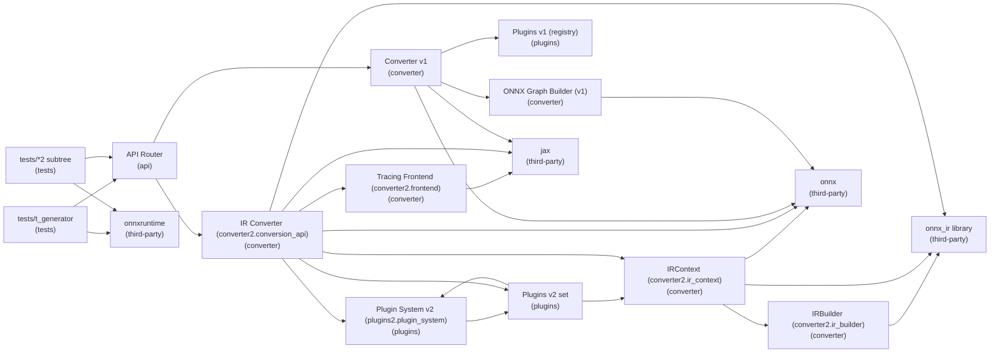

# jax2onnx — onnx_ir MVP — Overview

## Components
| id | name | layer | owns | provides | depends_on |
|---|---|---|---|---|---|
| `ui` | API Router | api | flag resolution, input normalization pass-through, error surface | to_onnx: route to converter1/2 | converter2, converter |
| `frontend2` | Tracing Frontend (converter2.frontend) | converter | normalize inputs to ShapeDtypeStruct (supports string dims), create JAX symbolic dims via jax.export.symbolic_shape, trace_to_jaxpr wrapper (optional) | _normalize_inputs_for_tracing(default_float), trace_to_jaxpr(fn, inputs, input_params) | jax |
| `ir_builder2` | IRBuilder (converter2.ir_builder) | converter | fresh_name counters, collect inputs/outputs/nodes/initializers, _var2val mapping, symbol origin maps: _sym_origin, _sym_origin_str, dtype mapping np→ir | Value/Node construction primitives | onnx_ir, numpy |
| `ir_context` | IRContext (converter2.ir_context) | converter | wrap IRBuilder; expose builder to plugins, bind graph inputs/outputs, bind_const_for_var (Literal-safe), get_value_for_var (Literal special case; dtype alignment), symbolic dim origin tracking (Value, axis), shape normalization to ir.Shape with symbolic strings, cast_like helper (ONNX CastLike), to_model_proto via onnx_ir.save → onnx.load_model | fresh_name, add_input_for_invar, add_outputs_from_vars, get_symbolic_dim_origin, cast_like, to_model_proto | ir_builder2, onnx_ir, onnx, numpy |
| `plugin_system2` | Plugin System v2 (plugins2.plugin_system) | plugins | registry PLUGIN_REGISTRY2, PrimitiveLeafPlugin / FunctionPlugin base classes, plugin_binding() context manager, import_all_plugins(), apply_monkey_patches() (legacy compatibility) | lookup primitive → plugin, activate plugin worlds | plugins2 |
| `plugins2` | Plugins v2 set | plugins | lower JAX primitives using IRContext + onnx_ir, dynamic target shapes via Shape/Gather/Concat (no int-cast of symbols), dtype alignment via CastLike | jax.lax.add/mul/sub (elementwise), jax.lax.broadcast_in_dim (symbolic-aware), nnx.linear (no-bias + high-rank variants) | plugin_system2, ir_context |
| `converter2` | IR Converter (converter2.conversion_api) | converter | feature-flagged entrypoint, _activate_plugin_worlds (import + bindings + legacy patches), trace to ClosedJaxpr using frontend2 normalization, construct IRContext, bind constvars, walk jpr.eqns and dispatch to plugins2, finalize outputs and serialize ModelProto, ORT-safe ir_version pin (10) | to_onnx(fn, inputs, input_params, opset, enable_double_precision, ...) → ModelProto | frontend2, plugin_system2, plugins2, ir_context, onnx_ir, onnx, jax |
| `converter` | Converter v1 | converter | trace to Jaxpr, drive legacy plugins, finalize ModelProto | to_onnx: ModelProto | jax, plugins, builder, onnx |
| `plugins` | Plugins v1 (registry) | plugins |  | primitive → emitter |  |
| `builder` | ONNX Graph Builder (v1) | converter |  | value_info, nodes, opset, model | onnx |
| `jax` | jax | third-party |  | make_jaxpr, export.symbolic_shape |  |
| `onnx_ir` | onnx_ir library | third-party |  | IR builder |  |
| `onnx` | onnx | third-party |  | ModelProto, IR_VERSION |  |
| `onnxruntime` | onnxruntime | third-party |  | inference engine (ORT) |  |
| `tests` | tests/t_generator | tests | numeric validation (ORT), routes flag to API |  | ui, onnxruntime |
| `tests2` | tests/*2 subtree | tests | force IR path via conftest, exercise symbolic shapes |  | ui, onnxruntime |

## Dependencies (Mermaid)

