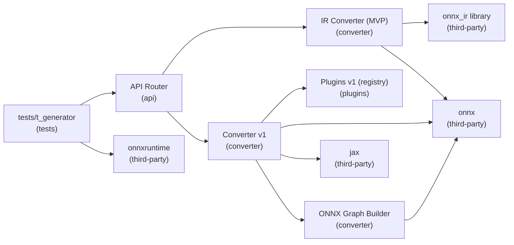

# jax2onnx — onnx_ir MVP — Overview

## Components
| id | name | layer | owns | provides | depends_on |
|---|---|---|---|---|---|
| `ui` | API Router | api | flag resolution, input normalization, error surface | to_onnx: route to converter1/2 | converter2, converter |
| `converter2` | IR Converter (MVP) | converter | build IR model, serialize | to_onnx: ModelProto | onnx_ir, onnx |
| `onnx_ir` | onnx_ir library | third-party |  | IR builder |  |
| `onnx` | onnx | third-party |  | ModelProto, IR_VERSION |  |
| `converter` | Converter v1 | converter | trace to Jaxpr, drive plugins, finalize ModelProto | to_onnx: ModelProto | jax, plugins, builder, onnx |
| `plugins` | Plugins v1 (registry) | plugins |  | primitive -> emitter |  |
| `builder` | ONNX Graph Builder | converter |  | value_info, nodes, opset, model | onnx |
| `jax` | jax | third-party |  | make_jaxpr, eval_shape |  |
| `onnxruntime` | onnxruntime | third-party |  | inference engine (ORT) |  |
| `tests` | tests/t_generator | tests | numeric validation (ORT) |  | ui, onnxruntime |

## Dependencies (Mermaid)

