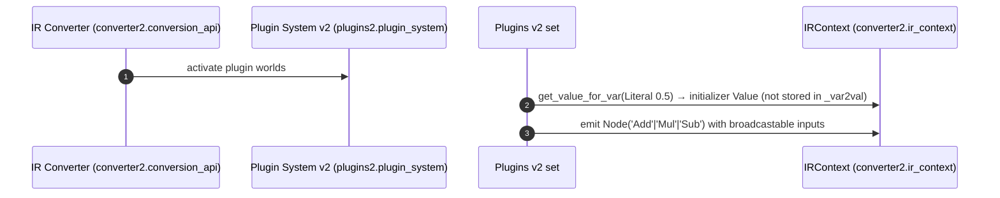

# Flow: add/mul/sub with JAX Literal

```mermaid
sequenceDiagram
  autonumber
  participant converter2 as IR Converter (converter2.conversion_api)
  participant plugin_system2 as Plugin System v2 (plugins2.plugin_system)
  participant plugins2 as Plugins v2 set
  participant ir_context as IRContext (converter2.ir_context)
  converter2->>plugin_system2: activate plugin worlds
  plugins2->>ir_context: get_value_for_var(Literal 0.5) → initializer Value (not stored in _var2val)
  plugins2->>ir_context: emit Node('Add'|'Mul'|'Sub') with broadcastable inputs
```
