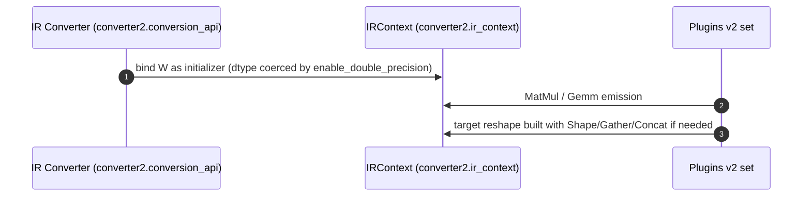

# Flow: nnx.linear (no bias), high-rank, dynamic batch

```mermaid
sequenceDiagram
  autonumber
  participant converter2 as IR Converter (converter2.conversion_api)
  participant ir_context as IRContext (converter2.ir_context)
  participant plugins2 as Plugins v2 set
  converter2->>ir_context: bind W as initializer (dtype coerced by enable_double_precision)
  plugins2->>ir_context: MatMul / Gemm emission
  plugins2->>ir_context: target reshape built with Shape/Gather/Concat if needed
```
