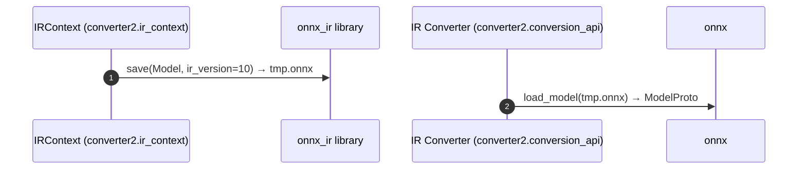

# Flow: serialize via onnx_ir

```mermaid
sequenceDiagram
  autonumber
  participant ir_context as IRContext (converter2.ir_context)
  participant onnx_ir as onnx_ir library
  participant converter2 as IR Converter (converter2.conversion_api)
  participant onnx as onnx
  ir_context->>onnx_ir: save(Model, ir_version=10) → tmp.onnx
  converter2->>onnx: load_model(tmp.onnx) → ModelProto
```
