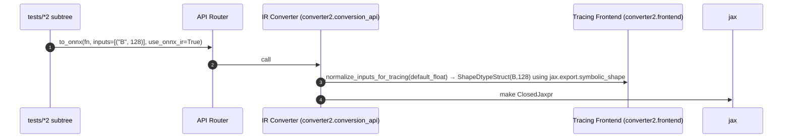

# Flow: trace with string dims → JAX symbols

```mermaid
sequenceDiagram
  autonumber
  participant tests2 as tests/*2 subtree
  participant ui as API Router
  participant converter2 as IR Converter (converter2.conversion_api)
  participant frontend2 as Tracing Frontend (converter2.frontend)
  participant jax as jax
  tests2->>ui: to_onnx(fn, inputs=[("B", 128)], use_onnx_ir=True)
  ui->>converter2: call
  converter2->>frontend2: _normalize_inputs_for_tracing(default_float) → ShapeDtypeStruct(B,128) using jax.export.symbolic_shape
  converter2->>jax: make ClosedJaxpr
```
