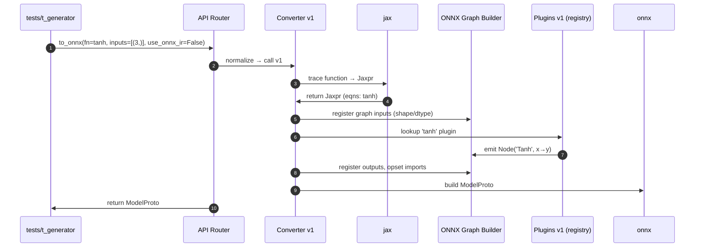

# Flow: tanh conversion via legacy pipeline

```mermaid
sequenceDiagram
  autonumber
  participant tests as tests/t_generator
  participant ui as API Router
  participant converter as Converter v1
  participant jax as jax
  participant builder as ONNX Graph Builder
  participant plugins as Plugins v1 (registry)
  participant onnx as onnx
  tests->>ui: to_onnx(fn=tanh, inputs=[(3,)], use_onnx_ir=False)
  ui->>converter: normalize → call v1
  converter->>jax: trace function → Jaxpr
  jax->>converter: return Jaxpr (eqns: tanh)
  converter->>builder: register graph inputs (shape/dtype)
  converter->>plugins: lookup 'tanh' plugin
  plugins->>builder: emit Node('Tanh', x→y)
  converter->>builder: register outputs, opset imports
  converter->>onnx: build ModelProto
  ui->>tests: return ModelProto
```
