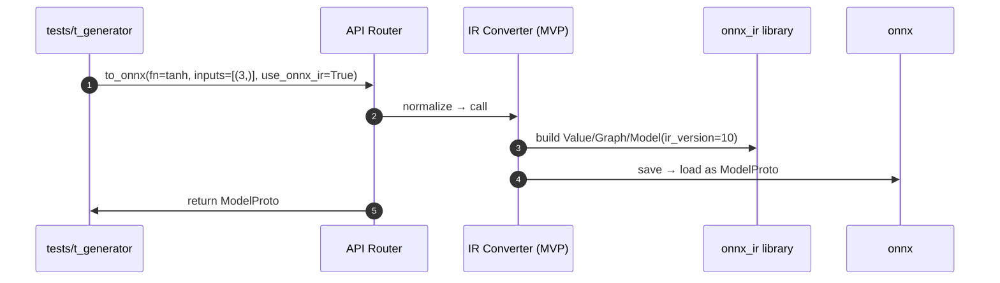

# Flow: tanh conversion via IR

```mermaid
sequenceDiagram
  autonumber
  participant tests as tests/t_generator
  participant ui as API Router
  participant converter2 as IR Converter (MVP)
  participant onnx_ir as onnx_ir library
  participant onnx as onnx
  tests->>ui: to_onnx(fn=tanh, inputs=[(3,)], use_onnx_ir=True)
  ui->>converter2: normalize → call
  converter2->>onnx_ir: build Value/Graph/Model(ir_version=10)
  converter2->>onnx: save → load as ModelProto
  ui->>tests: return ModelProto
```
